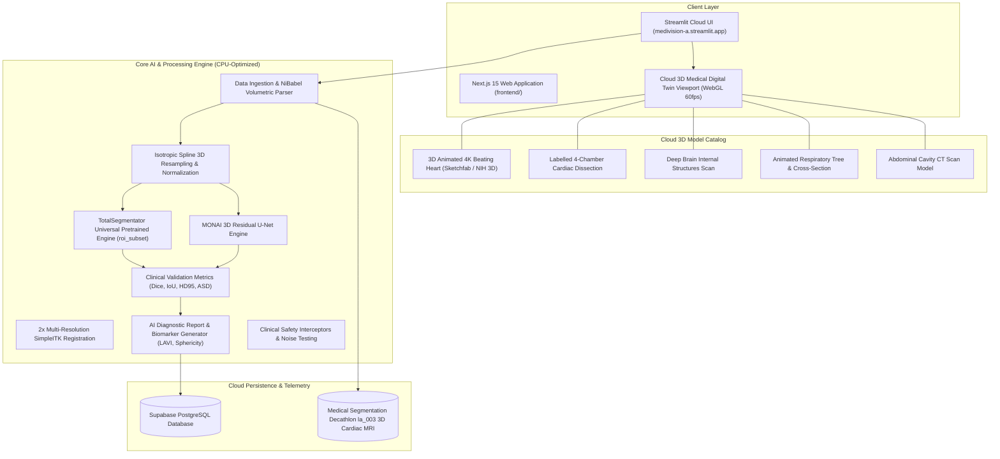

# Architecture & Component Specification — MediVision

> Comprehensive System Architecture and Dataflow for MediVision (3D Medical AI Suite).

---

## 1. High-Level System Architecture

---

## 2. Core Subsystems

### Subsystem 1: Clinical Dataset & Ingestion
* **Real Patient Ingestion:** Loads Medical Segmentation Decathlon (`Task02_Heart`) patient MRI scans (`.nii.gz`) with spatial affine matrices and anisotropic pixdim spacing.
* **Pre-processing:** Resamples scan to 1.0mm isotropic resolution using third-order spline interpolation and applies float32 z-score normalization.

### Subsystem 2: Dual-Engine 3D AI Segmentation
* **TotalSegmentator Universal Engine:** Targeted `roi_subset` (heart, aorta, liver, spleen, kidneys) running on CPU with zero thread contention (`OMP_NUM_THREADS=1`).
* **MONAI 3D Residual U-Net:** Sliding-window Gaussian inference with Hugging Face Hub pretrained weights (`ashhal/medivision-unet-heart`).

### Subsystem 3: Cloud-Deployed 3D Anatomical Digital Twin Suite
* **Zero-Lag 60fps WebGL Rendering:** Eliminates server-side rendering bottlenecks by connecting directly to cloud-hosted, textured, and animated 3D medical assets.
* **Specialties Covered:**
  1. **Cardiovascular:** 4K Animated beating heart with coronary vessels and 4-chamber labeled cardiac dissection.
  2. **Neurology:** Human brain with selectable internal structure dissection (Thalamus, Ventricles, Hippocampus).
  3. **Pulmonology:** Animated breathing respiratory tree with directional airflow cross-section.
  4. **Gastroenterology:** Abdominal cavity multi-organ CT 3D model and human liver donor scan.

### Subsystem 4: AI Diagnostic Reporting & Quantitative Biomathematics
* **Automated Biomarkers:** Left Atrial Volume ($cm^3$), Left Atrial Volume Index ($LAVI\ ml/m^2$), Sphericity Index, and Hausdorff 95 boundary error.
* **Standardized Diagnostic Impression:** Grades Left Atrial Enlargement (LAE) according to AHA/ESC guidelines and generates printable clinical markdown reports.

### Subsystem 5: Supabase Cloud Telemetry
* **Synchronous Audit Logging:** Records patient demographics, scan metadata, segmentation volumetrics, and validation metrics to remote PostgreSQL (`aluzqooagiymysssnhkg.supabase.co`).
