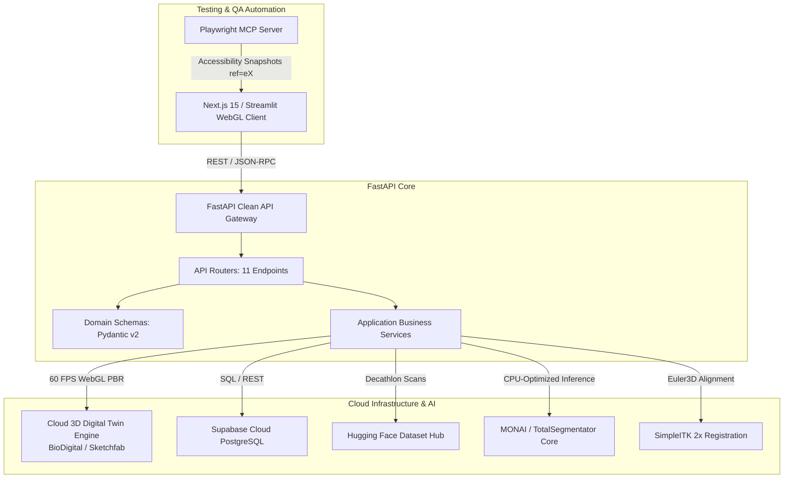

# MediVision — System Architecture Document

> Comprehensive technical blueprint for the MediVision 3D Medical AI & Anatomical Digital Twin Platform.

---

## 1. High-Level Architecture Overview

MediVision follows a **Clean, Cloud-Native Layered Architecture** connecting client-side WebGL viewports, a FastAPI API Gateway, deep learning microservices, and cloud databases.

---

## 2. Core Subsystems & Responsibilities

### 1. Presentation & API Gateway (`backend/app/api/`)
* **Data & Slices (`routes_data.py`):** Multi-Planar Reconstruction (MPR) orthogonal slice extraction across Axial, Coronal, and Sagittal planes with voxel intensity probing.
* **Preprocessing (`routes_preprocess.py`):** 3D cubic spline reslicing to isotropic spacing ($1.0 \times 1.0 \times 1.0 \text{ mm}$) and intensity z-score normalization.
* **3D Segmentation (`routes_segment.py`):** AI-powered multi-organ anatomical segmentation with volume calculation in $cm^3$.
* **Cloud 3D Digital Twins (`routes_reconstruct.py`):** Real-time catalog and 60 FPS WebGL iframe embeds for 6 anatomical systems.
* **Image Registration (`routes_register.py`):** Multi-resolution Euler3D/Affine alignment with Mean Squares and Mattes Mutual Information metrics.
* **Clinical Metrics (`routes_evaluate.py`):** Quantitative validation against ground truth (Dice, IoU, HD95, ASD).
* **Clinical Reports (`routes_report.py`):** Automated diagnostic report generation formatted for radiologist EHR review.
* **Cloud Telemetry (`routes_cloud.py`):** Asynchronous telemetry sync and patient audit logging with Supabase Cloud.

### 2. Domain Entities (`backend/app/domain/`)
* Strongly typed Pydantic models ensuring complete contract safety between frontend, backend, and external cloud APIs.

### 3. Cloud 3D Digital Twin Engine (`backend/app/services/reconstruct_service.py`)
* Serves photorealistic, interactive 3D anatomical models (Cardiology, Neurology, Pulmonology, Gastroenterology, Whole Body) directly from cloud CDN with 0 MB server GPU load.

### 4. Quality & Testing Interceptors (`TEST.md` & Playwright MCP)
* Automated 25-endpoint smoke tests, Gaussian noise stress testing, scan integrity validation, and end-to-end accessibility tree testing.
